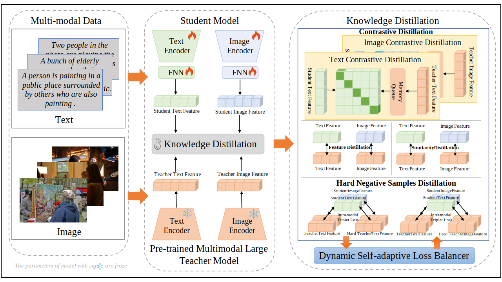

**Abstract:**In recent years, pre-trained multimodal large models have attracted widespread attention due to their outstanding performance in various multimodal applications. Nonetheless, the extensive computational resources and vast datasets required for their training present significant hurdles for deployment in environments with limited computational resources. To address this challenge, we propose a novel dynamic self-adaptive multiscale distillation from pre-trained multimodal large model for efficient cross-modal representation learning for the first time. Unlike existing distillation methods, our strategy employs a multiscale perspective, enabling the extraction structural knowledge across from the pre-trained multimodal large model. Ensuring that the student model inherits a comprehensive and nuanced understanding of the teacher knowledge. To optimize each distillation loss in a balanced and efficient manner, we propose a dynamic self-adaptive distillation loss balancer, a novel component eliminating the need for manual loss weight adjustments and dynamically balances each loss item during the distillation process. Our methodology streamlines pre-trained multimodal large models using only their output features and original image-level information, requiring minimal computational resources. This efficient approach is suited for various applications and allows the deployment of advanced multimodal technologies even in resource-limited settings. Extensive experiments has demonstrated that our method maintains high performance while significantly reducing model complexity and training costs. Moreover, our distilled student model utilizes only image-level information to achieve state-of-the-art performance on cross-modal retrieval tasks, surpassing previous methods that relied on region-level information.

**Main Work:**As first author, design frameword and lab, write code to implement the model.

[Download paper here](https://arxiv.org/abs/2404.10838)

Recommended citation: '**Zhengyang Liang**, Meiyu Liang, Wei Huang, Yawen Li, Zhe Xue. (2024).'